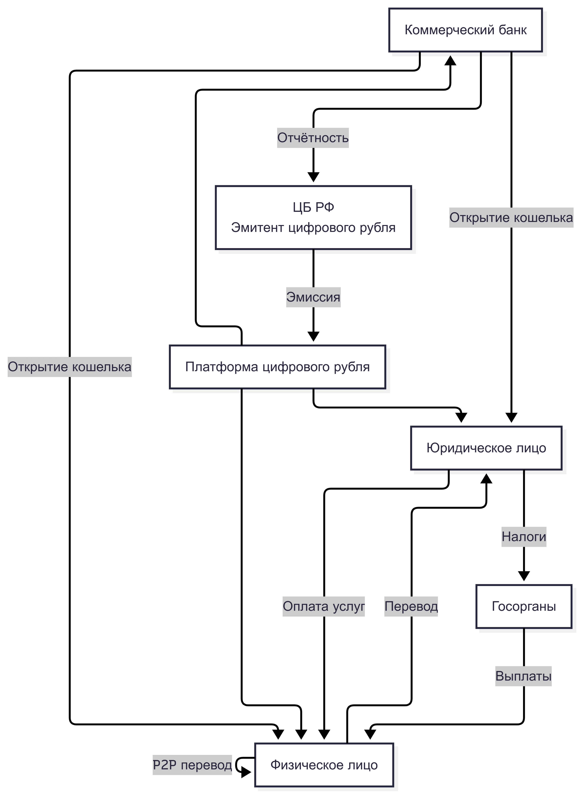
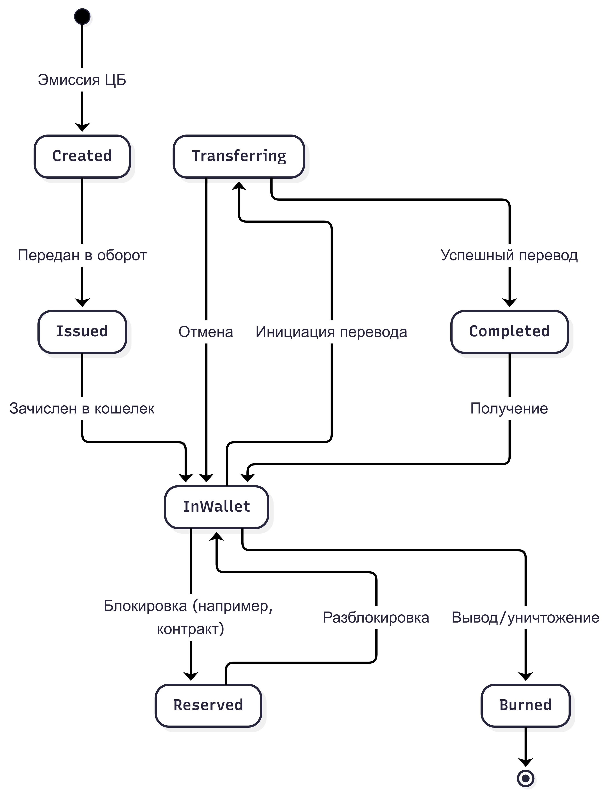
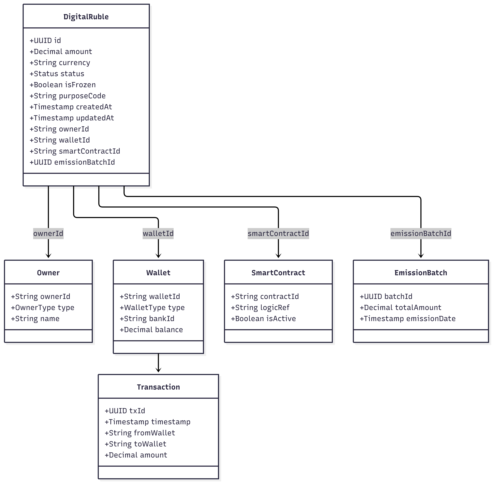
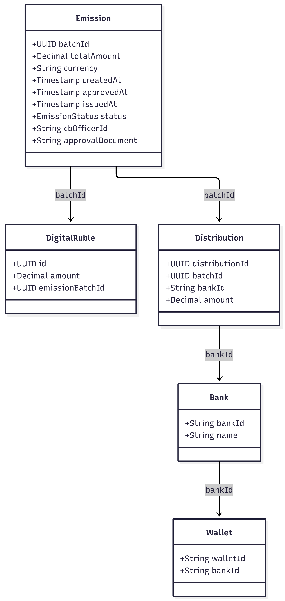
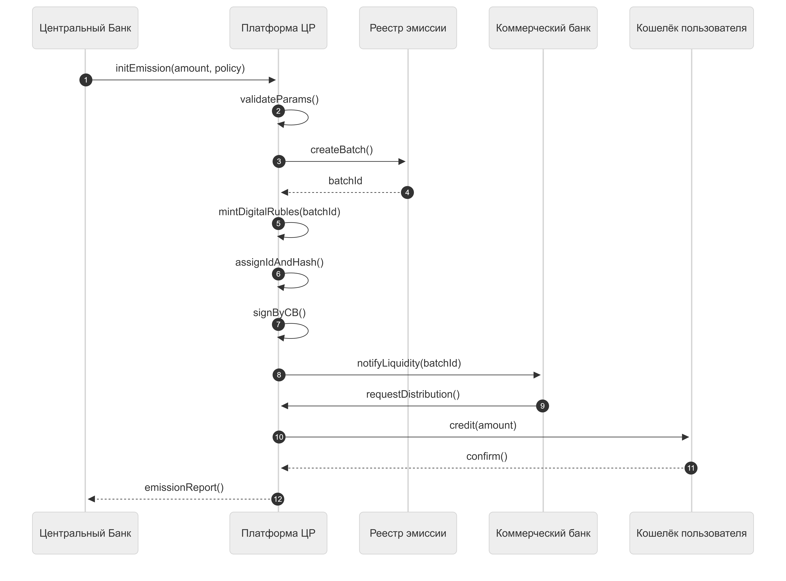

# TRPO
## Движение Цифрового Рубля

ЦБ РФ — единственный эмитент 
Платформа ЦР — ядро 
Коммерческий банк — посредник интерфейса 
Кошелёк — запись в системе ЦБ 

Created — создан, но ещё не используется 
Issued — введён в систему 
InWallet — лежит у пользователя 
Reserved — временно заморожен 
Transferring — в процессе перевода 
Completed — перевод завершён 
Burned — выведен из оборота 

id — уникальный идентификатор единицы 
amount — сумма 
currency — валюта 
status — текущее состояние 
isFrozen — флаг блокировки 
purposeCode — целевое использование 
ownerId — владелец 
walletId — привязка к кошельку 
smartContractId — если участвует в логике 
Смарт-контракты в банках — это самоисполняемые цифровые алгоритмы, работающие на технологии блокчейн, которые автоматически проводят сделки при выполнении заданных условий. Они исключают посредников, повышая скорость, прозрачность и снижая издержки. 
emissionBatchId — связь с эмиссией 
createdAt — дата создания 
updatedAt — дата обновления 

batchId — уникальный идентификатор эмиссии 
totalAmount — общий объём выпуска 
currency — валюта 
status — статус эмиссии 
createdAt — дата создания 
approvedAt — дата утверждения 
issuedAt — дата выпуска 
cbOfficerId — ответственный сотрудник ЦБ 
approvalDocument — документ подтверждения 
emissionBatchId — связь единицы с эмиссией 
bankId — банк-участник распределения 
walletId — кошелёк получателя 
distributionId — запись распределения между банками 

initEmission — ЦБ инициирует выпуск с параметрами 
validateParams — система проверяет корректность данных 
createBatch — создаётся партия эмиссии 
mintDigitalRubles — генерируются цифровые рубли 
assignIdAndHash — каждой единице присваивается уникальный ID и хеш 
signByCB — выпуск подписывается ЦБ 
notifyLiquidity — банк получает уведомление о доступной ликвидности 
requestDistribution — банк запрашивает распределение средств 
credit — зачисление цифровых рублей в кошельки пользователей 
confirm — подтверждение получения 
emissionReport — отчёт об эмиссии возвращается в ЦБ 
